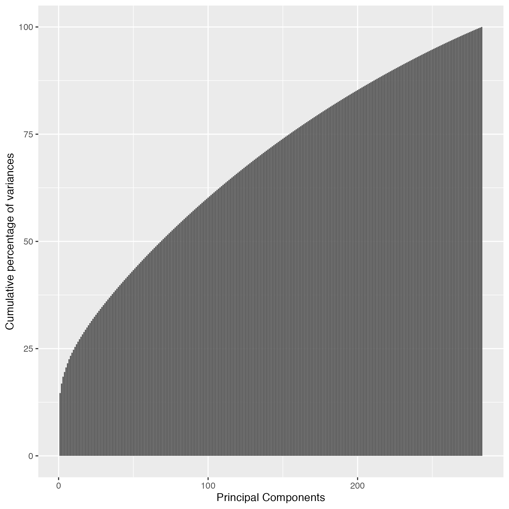

# Examples

## Example 1: Principal component analysis with R language

- Needed to run this example:
    - Docker
    - RStudio
    - skiftiTools
    - ENIGMA_DTI_FA_skeleton_mask.nii.gz file

- 1.0 Do DTI preprocessing e. g. with QSIprep, mrtrix, fsl

- 1.1 Align data to ENIGMA [1] template using ants TBSS package [2]:

    - 1.1.1 Place FA scalar maps into output folder (after this assuming that the FA maps are with .nii.gz suffix in subfolder called ‘output’)

    - 1.1.2 Create list of subject names to run e. g. :
        ```sh
        $ for f $(ls output); do echo $($f | awk -F’. ‘{print $1}’); done > caselist.txt
        ```
    - 1.1.3 Run ants TBSS with docker to create TBSS results to subfolder ‘out’:
        ```sh
        $ docker run -it –rm haanme/ants_tbss:0.4.2 -i $(pwd)/tractoinferno_FA -c caselist.txt –modality FA –enigma -o $(pwd)/out
        ```  
- 1.2 Run ants TBSS with docker to create TBSS results to subfolder ‘out’:
    Use the following docker command to create skifti file from TBSS output
    ```sh
    docker run --rm -v $(pwd)/tractoinferno_FA:/data haanme/lifespan_postprocess:0.2.3 /bin/bash -c "cd / ; Rscript Postprocess.R --path /data --outputpath /data/postprocess_output --TBSSsubfolder out --writepng No --subjectsfile /data/caselist.txt --filetype ASCII --compression zip"
    ```
    
This will create filename called UNKNOWN_FA_Skiftidata.zip

- 1.1.4 Run ants TBSS with docker to create TBSS results to subfolder ‘out’:

Use the following script, where 'postprocess_output' is the location where skifti file was created in the previous step.
```sh
source('Skifti_view.R')
source('Nifti2Skifti.R')
source('Skifti2Nifti.R')
source('Skifti_read.R')
source('writeSkifti.R')
library(e1071) 
library(ggplot2)

# Define input path, an
basedir<-paste('postprocess_output',sep='/')
maskfile<-paste('.','ENIGMA_DTI_FA_skeleton_mask.nii.gz',sep='/')

# 1 Unzip package in its folder
origdir<-getwd()
setwd(basedir)
unzip(paste('.', 'UNKNOWN_FA_Skiftidata.zip', sep='/'), overwrite=TRUE)
setwd(origdir)

f1<-paste(basedir, 'UNKNOWN_FA_Skiftidata.txt', sep='/')
# 3 Read skifti again
sk<-readSkifti(file=f1)

# Run Principal Component Analysis
res.pca <- PCA(sk$data, graph = FALSE)
eigenvalues <- res.pca$eig

# Print cumulative percentages
df_eigenvalues<-data.frame(x=1:dim(eigenvalues)[1], y=eigenvalues[,3], ylog=log10(eigenvalues[,3]))
min_ylog<-min(df_eigenvalues$ylog)
df_eigenvalues$ylog<-df_eigenvalues$ylog+min_ylog
p<-ggplot(df_eigenvalues, aes(x=x, y=y)) + 
  geom_bar(stat="identity") + 
  xlab('Principal Components') +
  ylab('Cumulative percentage of variances')
ggsave('FENS_stat_example1_tracktoinferno_PCA_cumulative_percantages.png')
```

```sh
# Write statistics into a file
mask<-RNifti::readNifti(maskfile, internal = FALSE, volumes = NULL)  
img_hdr<-niftiHeader(mask)

# Re-create Nifti object and save 3D rendering of it
a<-array(mask)
a[mask>0]<-res.pca$var$contrib[,1]
dim(a)<-img_hdr$dim[2:4]
dim(mask)<-img_hdr$dim[2:4]
save_skeleton(mask, a, img_hdr, "./FENS/FENS_stat_example1_tracktoinferno_comp1_voxelcontribution.png", "FA comp1", 100000)
```


[1] https://enigma.ini.usc.edu/protocols/dti-protocols/ [2] https://github.com/trislett/ants_tbss

## Installation: Github

Download from https://github.com/haanme/skiftiTools
## Installation: RStudio
<UNDER CONSTRUCTION>
