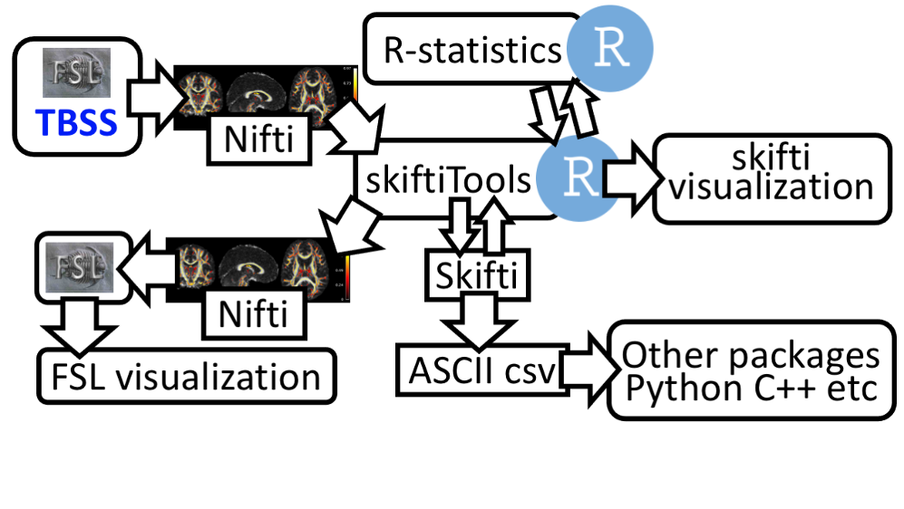

.. documentation master file, created by sphinx-quickstart 
   You can adapt this file completely to your liking, but it should at least
   contain the root `toctree` directive.

skiftiTools
================================

.. raw:: html

.. role:: red

.. This main document is in `'reStructuredText' ("rst") format

Analysis of three and four dimensional brain imaging data in various statistical settings there is growing invitation in tools facilitating data analysis in more tool independent manner. In brain image analysis, Tract-Based Spatial Statistics (TBSS) is a conventionally used tool to make statistical calculations in voxel-space for brain imaging data. While they provide support for basic statistical tests needed in neuroscience, with larger datasets and more complex test settings, their use becomes cumbersome. More sophisticated statistical operations are not supported.

skiftiTools provides a versatile package facilitating use of vast amount of statistical operations in R and other tools by writing tab separated values ASCII files which are easily readable by most commonly used statistical tools such as R language (RStudio), SPSS, SAS, GraphPad prism. After statistical processing, the resulting ASCII data can be then again read for visualization. The package supports Nifti image format, tab separated ASCII format, and its own stand-alone format for efficient disk usage. It is open source (https://github.com/haanme/skiftiTools), built on R-language and has easy installation from R’s CRAN package repository. In addition, it has basic functions available in docker containers for further planform independence.

Examples
--------

1. Using together with ants TBSS toolbox:
   
1.1 Align data to ENIGMA [1] template using ants TBSS package [2]:

| 1.1.1 Place FA scalar maps into output folder (after this assuming that the FA maps are with .nii.gz suffix in subfolder called 'output')
|
| 1.1.2 Create list of subject names to run e g::

   $ for f $(ls output); do echo $($f | awk -F'. '{print $1}'); done > caselist.txt
|
| 1.1.3 Run ants TBSS with docker to create TBSS results to subfolder 'out'::

   $ docker run -it --rm haanme/ants_tbss:0.4.2 -i $(pwd)/tractoinferno_FA -c caselist.txt --modality FA --enigma -o $(pwd)/out

[1] https://enigma.ini.usc.edu/protocols/dti-protocols/
[2] https://github.com/trislett/ants_tbss
